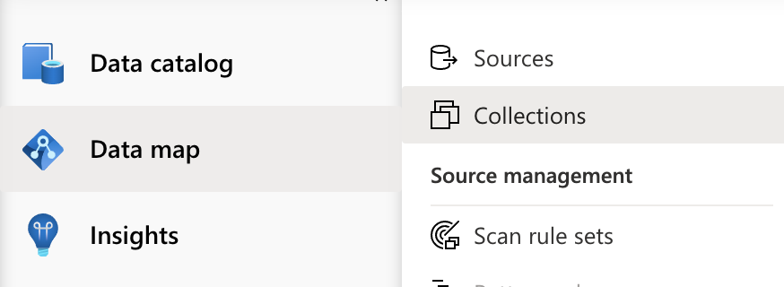

# purview-serverless

In this repo, you will find a sample project that showcases the use of the Python SDK of [Azure Purview](https://azure.microsoft.com/en-gb/services/purview/).

# Content

We cover the typical use-case of a company that owns a DataLake, and wants to scan its assets with Purview. 
We provide:

* A sample code that uses the [Azure Purview Scanning](https://azuresdkdocs.blob.core.windows.net/$web/python/azure-purview-scanning/1.0.0b2/index.html) and [Purview Catalog ](https://azuresdkdocs.blob.core.windows.net/$web/python/azure-purview-catalog/1.0.0b2/index.html) SDKs to do the most common operations in Python, namely:
    * Registering a datasource
    * Deleting a datasource
    * Creating a scan
    * Running a scan
    * Retrieving datasources
    * Retrieving scans and their runs histories
    * Searching the Purview catalog

* A basic serverless Architecture composed of:
    * Azure Storage 
    * Python Function App 
    * App Service Plan
    * Azure Purview instance
    * App Insights instance 
    
* An ARM Template to deploy the following architecture:

    <!-- [PUT DIAGRAM] -->

# How to use 
This sample requires you to have a recent version of Python installed (3.6+ although we recommend 3.8+). 
There are three main steps described next:
1. [Deploying the required resources](#running-the-functions)
2. [Deploying the Function App](#deploying-the-function-app)
3. [Granting the Function App access to Purview](#)

## Deploying the infrastructure
You have two options to deploy the infrastructure with the provided [ARM Template](https://docs.microsoft.com/en-us/azure/azure-resource-manager/templates/overview).

### Option 1: Deploy the ARM template via the portal
Click on the following button: 

[](https://portal.azure.com/#create/Microsoft.Template/uri/https%3A%2F%2Fraw.githubusercontent.com%2Fatrao%2Fpurview-serverless%2Fdocumentation%2Finfra%2Fazuredeploy.json) 


You can choose an existing ressource group in the drop-down menu or a create a new one. Click on "Review + Create". Select "Create" once the validation succeeds.

### Option 2: Deploy the ARM via the Azure CLI
This option requires the [Azure CLI](https://docs.microsoft.com/en-us/cli/azure/install-azure-cli) to be installed.

1. Log in to you Azure account 

    ```
    az login
    ```

2. Create a Resource Group 

    ```
    $resourceGroup = "MyResourceGroupName"
    $location = "westeurope" 
    az group create -n $resourceGroup -l $location
    ```

    NB: You can find the list of all the Azure regions byentering the following command:
    ```
    az account list-locations -o table 
    ```

3. Deploy the resources 
    ```
    az deployment group create --resource-group $resourceGroup --template-file ./infra/azuredeploy.json
    ```


## Deploying the Function App 
You can deploy the Function App in various ways. Here we presentt two of them: via Visual Studio Code or the Azure CLI.

### Option 1: Deploy with VS Code
This option requires the installation of [Visual Studio Code](https://code.visualstudio.com/) and the [Azure Functions extension](https://marketplace.visualstudio.com/items?itemName=ms-azuretools.vscode-azurefunctions).

Steps:
1. Open a new VS Code window

2. Manually clone this repo or click on "Clone Git Repository" in VS Code    

3. Create an environment and install the required packages
    ```
    python3.8 -m venv .venv
    source .venv/bin/activate
    pip install -r requirements.txt
    ```

4. Go on the Azure Extension tab and sign-in to your Azure account. Roll out Functions menu: the Function App appears under your subscription and the "Local Project" folder.

5. On the Functions menu, click on the "Deploy the Function App" button:
    
Whem prompted, select your subscription and the remote Function app at the top of the editor.

### Option 2: Deploy with the Azure CLI
Will soon be detailed.

## Grant the Function app the access to the Purview instance
In the ARM template, we are turning on the [System Managed Identity](https://docs.microsoft.com/en-us/azure/active-directory/managed-identities-azure-resources/overview) of the Azure Function App. In this last step, we are granting rights to this managed identity on the root collection of Purview. This is done via the portal.

1. First go on the [Azure portal](https://portal.azure.com/#home), and access the Azure Function App resource  that was deployed previously. On the left pane, select "Identity" under the "Settings" tab:

    
    

    Ensure that under "System Assigned", "Status" is toggled on.

2. Access the Purview instance via the portal. 

   Select "Open Purview Studio" or [open Azure Purview's home page](https://ms.web.purview.azure.com/) and choose the instance that you deployed.

3. Inside Purview Studio, go to the collections:

    

    Select the root collection, and go on the "Role assignments" tab.
    Add the Function App in the following roles: Collection admins, Data source admins, Data curators, Data readers.


##  Running the functions
Once the three steps above are complete, you can run the functions in several manners. For example:

* [Via the portal](https://docs.microsoft.com/en-us/azure/azure-functions/functions-create-function-app-portal#test-the-function)
* Using a tool or an extension to trigger HTTP requests, like [Postman](https://www.postman.com/) 
* Using the Azure [Functions extension of Visual Studio Code](https://docs.microsoft.com/en-us/azure/azure-functions/functions-develop-vs-code?tabs=python#run-functions).


## Examples
The functions have input parameters that need to be specified either as query parameters or passed in a body input. However functions that only accept GET requests (like _getDatasources_ for instance) only accept [route parameters](https://docs.microsoft.com/en-us/azure/azure-functions/functions-bindings-http-webhook-trigger?tabs=csharp#using-route-parameters). 
Here are a some examples:

* Registering a new Datasource (Azure Storage):
    
    Trigger the _createOrUpdateDatasource_ function with the following request body:
    ```
    {
        "ds_name": "myDataSource"
    }
    ```
    or pass _ds_name_ as a query parameter.

* Creating a scan:

    
    Trigger the _createOrUpdateScan_ function with the following request body:
    ```
    {
        "ds_name": "myDataSource",
        "scan_name": "myScanName"
    }
    ```
    or pass _ds_name_ and _scan_name_as a query parameters.

* Running a scan:
    
    Trigger the _runScan_ function with the following request body:
    ```
    {
        "ds_name": "myDataSource",
        "scan_name": "myScanName"
    }
    ```
    or pass _ds_name_ and _scan_name_as a query parameters.

* Getting a scan run history:
    Trigger the _getScanHistory_ function with a GET request by specifiying route parameters:
    '''
    https://yourfunctionappname.azurewebsites.net/api/runs/ds_name/scan_name
    '''

* Searching for an asset
    Trigger the _searchCatalog_ function with the following request body:
    ```
    {
        "keywords": "mySearch"
    }
    ```
    or pass "keywords" as a query parameter.

* etc...


## Notes on the design and the code
* During the deployment, we configure App settings for the Function App. Those settings are used several parts of the code.
* The Purview instance is toggled on and is granted the access to the Storage account using the ARM template
* For the sake of this sample, we work exclusively with the root collection of Purview
* Purview can work with many data sources types. However in this sample, we only work with the "Azure Storage" type that we define in the App settings. To work with different types, you can adapt body that is used in several functions:

    ```
    {
        "kind":f"{os.environ['StorageKind']}Msi", 
        "properties": { 
            "scanRulesetName": os.environ['StorageKind'], 
            "scanRulesetType": "System", 
            "collection": 
                {
                    "referenceName": os.environ['ReferenceNamePurview'], 
                    "type": "CollectionReference"
                }
        }
    }
    ```
    For example if you want to register an AWS S3 bucket, you can change the body to:
    ```
    {
        "kind": "AmazonS3",
        "name": "ChosenDatasourceName",
        "properties": {
            "serviceUrl": "s3://yourbucketserviceurl",
            "collection": {
                "referenceName": os.environ['ReferenceNamePurview'],
                "type": "CollectionReference",
            }
        }
    }
    ```


